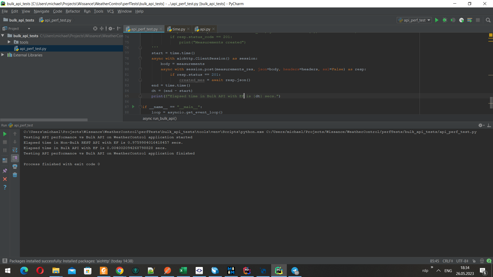

## Wissance.WebApiToolkit

[](https://github.com/quozd/awesome-dotnet#api) 
 

 

* Core  
* Ef extensions 
* Cloud AWS S3 utils 


##  One Line of code for Fully functional CRUD Controller with Swagger doc


## Why Wissance.WebApiToolkit

|                    Without                     |                 With Wissance.WebApiToolkit              |
| -----------------------------------------------| ---------------------------------------------------------|
| :no_entry: Manual support for the `API` uniformity        | :white_check_mark: Output of all REST methods is standardize                |
| :no_entry: Every Controller requires at least **20 min** to be written  | :white_check_mark: Up to one line of code for fully functional `CRUD`       |
| :no_entry: Inconsistent error response                    | :white_check_mark: Unified error format out of the box                      |
| :no_entry: Requires to rewrite controllers to add a new<br/> technology  | :white_check_mark:  Requires only a new Manager class          |
| :no_entry: Not supporting bulk operation by default       | :white_check_mark: Up to one line of code for fully functional `BULK` `API` |
| :no_entry: Controller logic can't be easily used for<br/>`gRPC` or `SignalR`    | :white_check_mark: You could have the same Manager to<br/> handle `REST`, `gRPC`,and a `SignalR` simultaneously                         |
| :no_entry: Paging and Sorting should be written for<br/>every controller separately       | :white_check_mark: Paging and sorting are implemented<br/> out of the box in the uniform manner     |

## Minimal example

For the full doc see the [ :books: project wiki](https://github.com/Wissance/WebApiToolkit/wiki), to add in one line, for example i break it to `Assembly` get and add `Controller`, i.e.:
1. Generate assembly:
```csharp
Assembly stationControllerAssembly = services.AddSimplifiedAutoController<StationEntity, Guid, EmptyAdditionalFilters>(
                provider.GetRequiredService<ModelContext>(), "Station",
                ControllerType.FullCrud, null, provider.GetRequiredService<ILoggerFactory>());
```
2. Add Controller from assembly:
```csharp
services.AddControllers().AddApplicationPart(stationControllerAssembly).AddControllersAsServices();
```

### Key Features

* :fire: `REST API Controller` with **full `CRUD`** contains ***only 20 lines*** of code (~ 10 are imports)
  - `GET` methods have ***built-in paging*** support;
  - `GET` methods have ***built-in sorting and filter*** by query parameters;
* :rocket: ***BULK operations*** with objects (Bulk `Create`, `Update` and `Delete`) on a Controller && interface level
* :brain: support to work with ***any persistent storage*** (`IModelManager` interface); Good built-in EntityFramework support (see `EfModelManager` class). See [WeatherControl App](https://github.com/Wissance/WeatherControl) which has 
* :art: Manager classes that support file operation over:
  - web folders (folders from mounted devices or just local folders)
  - S3 AWS-compatible (tested with `Yandex Object Storage` and previously with `Cloudflare R2` and `Amazon S3`)
    
:cool: `Bulk` vs :no_good_man: Non-Bulk, `Wissance.WebApiToolkit` has Bulk out of the box:



* :scream: Elapsed time in Non-Bulk REST API with EF is <span style="color:red">~976 ms.</span>
* :fire: Elapsed time in Bulk API with EF is <span style="color:green">**~4 ms**.</span>

:sparkles: Result : Bulk `API` is almost <span style="color:green">**~250 x faster**</span>!

### Additional materials (Post, articles, video)

You could see our articles about Toolkit usage:
* :writing_hand: [Medium article about v1.0.x usage]( https://medium.com/@m-ushakov/how-to-reduce-amount-of-code-when-writing-netcore-rest-api-services-28352edcfca6)
* :writing_hand: [Dev.to article about v1.0.x usage]( https://dev.to/wissance/dry-your-web-api-net-core-with-our-toolkit-cbb)
* :writing_hand: [One line for full CRUD Medium article](https://m-ushakov.medium.com/rest-controller-in-one-line-in-net-171f46737905)

### Contributors

<a href="https://github.com/Wissance/WebApiToolkit/graphs/contributors">
  
</a>
