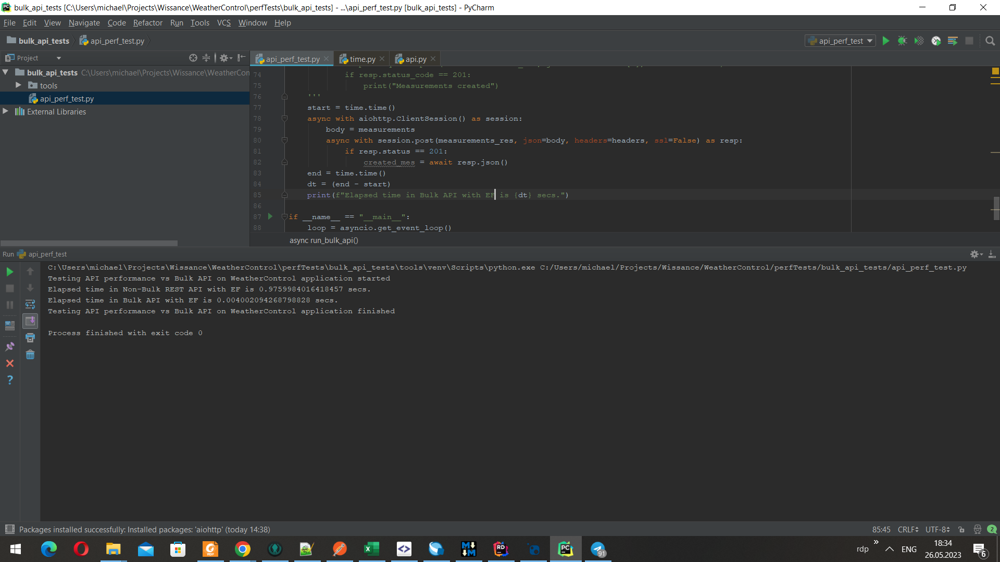

## Wissance.WebApiToolkit

[](https://github.com/quozd/awesome-dotnet#api) 
 

 
[](https://github.com/Wissance/WebApiToolkit/actions/workflows/ci.yml)

* Prev Version <= 3.0.0  
* Core  
* Ef extensions 
* Cloud AWS S3 utils 


##  One Line of code for Fully functional CRUD Controller with Swagger doc


## Why Wissance.WebApiToolkit

|                    Without                     |                 With Wissance.WebApiToolkit              |
| -----------------------------------------------| ---------------------------------------------------------|
| :no_entry: Manual support for the `API` uniformity        | :white_check_mark: Output of all REST methods is standardize                |
| :no_entry: Every Controller requires at least **20 min** to be written  | :white_check_mark: Up to one line of code for fully functional `CRUD`       |
| :no_entry: Inconsistent error response                    | :white_check_mark: Unified error format out of the box                      |
| :no_entry: Requires to rewrite controllers to add a new<br/> technology  | :white_check_mark:  Requires only a new Manager class          |
| :no_entry: Not supporting bulk operation by default       | :white_check_mark: Up to one line of code for fully functional `BULK` `API` |
| :no_entry: Controller logic can't be easily used for<br/>`gRPC` or `SignalR`    | :white_check_mark: You could have the same Manager to<br/> handle `REST`, `gRPC`,and a `SignalR` simultaneously                         |
| :no_entry: Paging and Sorting should be written for<br/>every controller separately       | :white_check_mark: Paging and sorting are implemented<br/> out of the box in the uniform manner     |
| :no_entry: Controller method can't be easily switched on/off       | :white_check_mark: It is possible to use some of `CRUD` or `BULK CRUD` methods easily (switch them off and back on from routing and `API Explorer`)     |


## Minimal example

For the full doc see the [ :books: project wiki](https://github.com/Wissance/WebApiToolkit/wiki), to add in one line, for example i break it to `Assembly` get and add `Controller`, i.e.:
1. Generate assembly:
```csharp
Assembly stationControllerAssembly = services.AddSimplifiedAutoController<StationEntity, Guid, EmptyAdditionalFilters>(
                provider.GetRequiredService<ModelContext>(), "Station",
                ControllerType.FullCrud, null, provider.GetRequiredService<ILoggerFactory>());
```
2. Add Controller from assembly:
```csharp
services.AddControllers().AddApplicationPart(stationControllerAssembly).AddControllersAsServices();
```

## Key Features

* :fire: `REST API Controller` with **full `CRUD`** contains ***only 20 lines*** of code (~ 10 are imports)
  - `GET` methods have ***built-in paging*** support;
  - `GET` methods have ***built-in sorting and filter*** by query parameters;
* :rocket: ***BULK operations*** with objects (Bulk `Create`, `Update` and `Delete`) on a Controller && interface level
* :brain: support to work with ***any persistent storage*** (`IModelManager` interface); Good built-in EntityFramework support (see `EfModelManager` class). See [WeatherControl App](https://github.com/Wissance/WeatherControl) which has 
* :art: Manager classes that support file operation over:
  - web folders (folders from mounted devices or just local folders)
  - S3 AWS-compatible (tested with `Yandex Object Storage` and previously with `Cloudflare R2` and `Amazon S3`)
    
* :cool: `Bulk` vs :no_good_man: Non-Bulk, `Wissance.WebApiToolkit` has Bulk out of the box:
* :hammer_and_wrench: it is possibly to switch some or even all default `CRUD` or `BULK` methods from controller by setting `AllowedOperation` attribute see [the docs](https://github.com/Wissance/WebApiToolkit/wiki/REST-Controller-method-configuration)




* :scream: Elapsed time in Non-Bulk REST API with EF is <span style="color:red">~976 ms.</span>
* :fire: Elapsed time in Bulk API with EF is <span style="color:green">**~4 ms**.</span>

:sparkles: Result : Bulk `API` is almost <span style="color:green">**~250 x faster**</span>!

## Additional materials (Post, articles, video)

You could see our articles about Toolkit usage:
* :writing_hand: [Medium article about v1.0.x usage]( https://medium.com/@m-ushakov/how-to-reduce-amount-of-code-when-writing-netcore-rest-api-services-28352edcfca6)
* :writing_hand: [Dev.to article about v1.0.x usage]( https://dev.to/wissance/dry-your-web-api-net-core-with-our-toolkit-cbb)
* :writing_hand: [One line for full CRUD Medium article](https://m-ushakov.medium.com/rest-controller-in-one-line-in-net-171f46737905)

## Versions History (Releases)

### Versions 1.0.0 - 3.0.0

* Created base controllers for ReadOnly (get many, get one) and FullCRUD (`ReadOnly` + `Create` + `Update` + `Delete`) operations.
* Created base controllers for CRUD BULK operation (`~/api/bulk`) .
* Created a common interface for passing paging and sorting.
* Added support for controllers creation with `EntityFramework` as a DB technology.
* Supported `API Explorations` with show all query parameters in `swagger`.
* Supported the creation of `gRPC` services based on `IModelManager`.

### Version 4.0.0 - 4.x.x

* `WebAPIToolkit` project was separated on `WebAPIToolkit.Core` with interface parts only, and this part
is independent from database techology.
* Added support for operation with files, either a local or network holder or `S3 AWS Compatible Cloud Storage`.

Version `4.x.x` is active to support important features for outdated `.Net` plafrorms (`.netcoreapp3.1` and `.net5.0`)

### Version 5.0.0

* Removed support of `.netcoreapp3.1` and `.net5.0`
* Added support for the `net9.0`
* Updated package version to keep `net6.0`

### Version 5.1.0

* Generation tools development and it is possible to create Controllers dynamically with up to 1 line of code

### Version 5.2.0

* GitHub actions for CI (`Build +test run`)
* Added an additional method for `1-line` controller add that has a factory func, to return a different result from methods
* `Create` && `Update` factory methods are having now `DbContext` for proper working with `many-2-many` by default

### Version 5.3.0

* Added ability to easily switch off by attribute from routing any methods of base controllers

## Contributors

<a href="https://github.com/Wissance/WebApiToolkit/graphs/contributors">
  
</a>
